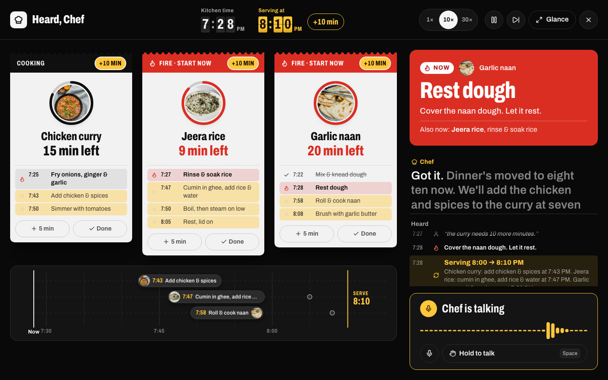
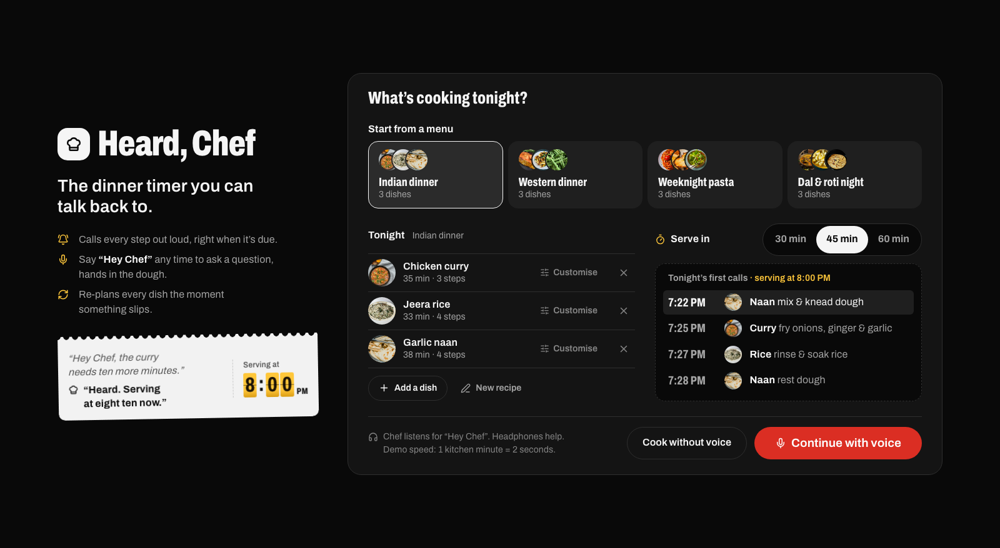
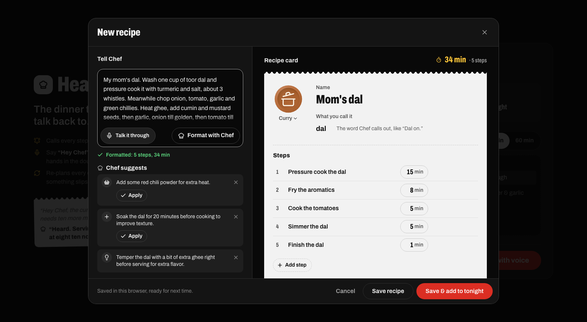

# Heard, Chef

**The dinner timer you can talk back to.** A calm voice head chef that runs the timing of a multi-dish dinner:
- it calls every step out loud, right when it's due
- say **"Hey Chef"** mid-cook and it answers, or re-plans every dish when something slips
- bring your own recipes: **type or say one**, and Chef turns it into timed steps and suggests improvements

Built for the [AssemblyAI Voice Agent Hackathon](https://lablab.ai/ai-hackathons/assemblyai-voice-agent-hackathon).



| Pick a menu, make it yours | Say or type a recipe; Chef formats and times it |
|---|---|
|  |  |

## Why

Cooking one dish is easy. Landing three dishes hot at the same minute is hard, and it happens when your hands are in raw chicken and your eyes are on the pan. You can't touch a screen then, and you can't re-time three dishes in your head while stirring. So you just say it: *"Hey Chef, the curry needs ten more minutes."* The whole dinner re-plans, and Chef tells you what changed.

More in [docs/pitch.md](docs/pitch.md) (what's unique, how it compares, business value) and [docs/demo-script.md](docs/demo-script.md).

## How it uses AssemblyAI

Two AssemblyAI products work together from one static page. **There is no backend.**

| | Role | Features used |
|---|---|---|
| **Universal-Streaming** (realtime STT, v3) | Chef's always-on ears, and recipe dictation | Detects "Hey Chef" with keyterms prompting. Word-level timestamps drive an exact pre-roll replay starting at the "hey" word. Also powers the cook's live captions. In the recipe studio, it dictates recipes with formatted turns and cooking keyterms (toor dal, jeera, tadka…). |
| **Voice Agent API** | Chef's brain and voice, and the recipe scribe | Speech-to-text, LLM, TTS and turn detection over one WebSocket. JSON-schema tool calls run in the browser. `reply.create` sends proactive kitchen calls. Word-timed `transcript.agent.delta` drives captions synced to the voice. Barge-in, keyterms, and the "michael" voice. A second, text-only session is the **scribe**: `reply.create` carries the cook's recipe text, and a nested-schema tool call returns a structured, timed recipe with suggestions in about 2 seconds. |

A deterministic planner in the browser does all the timing maths. Chef changes the plan only through seven tools (`report_delay`, `shift_serve_time`, `restart_step`, `mark_done`, `kitchen_status`, `add_dish`, `remove_dish`) and reads back the planner's summary, so the times you hear are never made up.

## Quick start

```bash
npm install
cp .env.example .env.local   # then put your AssemblyAI key in it
npm run dev                  # open http://localhost:5173
```

- Use **Chrome** and **headphones**, so Chef can't hear itself through your speakers.
- Pick one of four menus (or one you saved), customise tonight's dishes, pass the "Hey Chef" sound check, and start cooking.
- **Your own recipes:** click **New recipe**, then type, paste, or press **Talk it through**. Chef formats the recipe into timed steps and suggests improvements; you can edit everything by hand. Recipes and menus are saved in this browser, ready for next time.
- **Mid-cook:** "Hey Chef, add the dal tadka tonight" or "drop the naan" re-plans the whole dinner.
- **No key or mic?** Choose **Cook without voice** on the start screen. The whole kitchen runs from the keyboard.
- Demo speed is 30×, so 1 kitchen minute is 2 seconds. Switch to 1× in the top bar for a real dinner.

| Key | Action |
|---|---|
| hold `Space` | Talk to Chef without saying the wake phrase |
| `N` | Jump to the next call (at the end, jumps to service) |
| `P` | Pause or resume the kitchen clock |
| `S` | Cycle speed: 1× · 10× · 30× |
| `G` / `Esc` | Glance mode: giant next call for across the kitchen |
| `M` | Mute the mic |

## Tests

```bash
npm test                 # 309 unit + component tests
AAI_KEY=$(grep VITE_ASSEMBLYAI_API_KEY .env.local | cut -d= -f2) npm run test:e2e   # 16 live tests: tool routing, add/drop dish, cooking Q&A, guardrails, the scribe
npm run test:ui          # 17 Playwright flows: full dinner, all menus, own recipes, saved menus, fit at 1600×878 / 1440×790
npm run test:voice       # real voice: a fake mic says "Hey Chef, the curry needs ten more minutes"
npm run test:studio      # the live scribe formats a typed recipe in the browser
npm run test:dictation   # a fake mic dictates a recipe; the card fills in
```

The live, voice, studio and dictation tests call the real AssemblyAI API and use macOS `say` to synthesize speech.

## Architecture

```
Browser (Vite + React + TypeScript, static)
├─ kitchen/  recipes · library (localStorage) · drafts · planner (pure, tested) · virtual clock · store
├─ voice/    mic → AudioWorklet → PCM16 24 kHz ─┬─► Universal-Streaming: wake phrase, captions
│                                               └─► Voice Agent API (only after "Hey Chef"; silence otherwise)
│            tool.call → planner → UI updates at once → tool.result → Chef reads the summary
│            clock tick → step due → bell + on-screen call + callout queue → reply.create
│            recipe studio: dictation (Universal-Streaming) → scribe (Voice Agent API, text in → save_recipe / suggest)
└─ ui/       menu builder · recipe studio · split-flap clocks · dish tickets · the rail · NEXT UP · captions · Heard log · voice bar
```

Full design: [docs/superpowers/specs/2026-09-28-heard-chef-design.md](docs/superpowers/specs/2026-09-28-heard-chef-design.md), plus [menus and the recipe studio](docs/superpowers/specs/2026-09-29-menus-and-recipe-studio.md). The measured API behavior it's built around is in [docs/research.md §8](docs/research.md).

**About the key.** The browser can't mint AssemblyAI session tokens because that endpoint has no CORS support, but the WebSocket accepts the API key directly. That's what makes a backend unnecessary.
- The key comes from `.env.local`, which is gitignored and never committed. Vite inlines it at build time, so **a deployed build exposes it**. Use a limited key and rotate it.
- If AssemblyAI stops accepting raw keys, the fallback is a same-origin rewrite to `/v1/token`: hosting config only, no code.

**Privacy.** While a session is live, mic audio streams to AssemblyAI so the wake phrase can be detected. Chef's agent only hears what follows "Hey Chef". The only thing the app keeps is your own recipes and saved menus, in this browser's localStorage. There's no server or account.

## Project docs

This repo was built docs-first. See [docs/team-handoff.md](docs/team-handoff.md) for the latest status, and [docs/decisions.md](docs/decisions.md) for why things are the way they are.

## Credits

- Dish photos from [Unsplash](https://unsplash.com/license):
  - chicken curry by [Sushmita Chatterjee](https://unsplash.com/@sheclicks)
  - jeera rice by [Zoshua Colah](https://unsplash.com/@zoshuacolah)
  - garlic naan by [Rashpal Singh](https://unsplash.com/@rashpalsingh)
  - roast potatoes by [Markus Winkler](https://unsplash.com/@markuswinkler)
  - salmon by [Karyna Panchenko](https://unsplash.com/@karyna_panchenko)
  - green beans by [Bob Bowie](https://unsplash.com/@connave)
  - spaghetti pomodoro by [Paish Zaini](https://unsplash.com/@paishzaini)
  - garlic bread by [Louis Hansel](https://unsplash.com/@louishansel)
  - green salad by [Mads Eneqvist](https://unsplash.com/@madseneqvist)
  - dal tadka by [Anil Sharma](https://unsplash.com/@anil_sharma_india)
  - aloo gobi by [Markus Winkler](https://unsplash.com/@markuswinkler)
  - roti by [Anshu A](https://unsplash.com/@anshu18)
- Icons and plate art: [Lucide](https://lucide.dev) (ISC).
- Font: [Archivo](https://fonts.google.com/specimen/Archivo) (OFL).
- Speech, reasoning and voice: [AssemblyAI](https://www.assemblyai.com).

MIT licensed. See [LICENSE](LICENSE).
